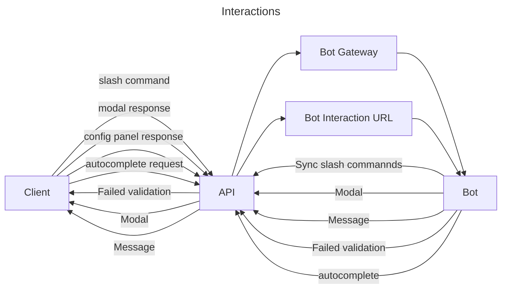

- Feature Name: Interactions
- Start Date: 06/04/2023
- RFC PR: https://github.com/revoltchat/rfcs/issues/0000
- Tracking Issue: https://github.com/revoltchat/revolt/issues/0000
- Status: draft

# Summary

Interactions are a way of interacting with bots in a higher level with better intergration
with revolt and the UI. This will include, slash commands, message blocks, context menu commands,
customizable config page and a dashboard.

# Motivation

A large part of developing a bot is handling a lot underlying parts like command handling and
a way to let users configure the bot for there server, as both of these can be done in a variety
of ways it can cause a lot of fragmentation in the ways its done, different bots could parse
commands in different ways making it hard for the user to remember how each bot handles it,
increasing cognitive load on the user, along with this is the fact that there is no UI to support
it as its all handled by the bot. In a similar case configuring the bot can be either done via
commands or via a website which requires the user to leave revolt.

# Guide-level explanation

## Slash command

A defined command users can invoke to trigger actions from a bot, the parameters are known and
is intergrated into the UI in a way that the user can understand what the command takes before
they run it and while writing it. Invoking a slash commands requires typing "/" into the message
box. Slash commands are never sent as a message and are instead directly sent as a seperate request,
other people will not see the command being sent unless the response is a message.

Slash commands are able to have parameters with a variety of types and subcommands to group commands
together.

parameters are able to have autocomplete to allow entering certain types of infomation easier.

## Context Menu Commands

Context menu commands are actions you can invoke on any message or user from the context menu
(right click or click and hold on mobile), these allow users to run actions on a message or user.

member context menu commands are not attached to any specific channel and are invoked at a server level,
message context menu commands have the message's channel attached.

## Ephermeral Messages

Ephermeral messages are messages which only one user can see, they can be sent as response to interactions,
they are not stored in the server and are only sent to the user.

## Blocks

Blocks are a way of building messages to include different interactable elements, these blocks
are the basis of interactions and are the entrypoint for the interaction flow, blocks are shown in a vertical
column under the message.

Only bots are capable of sending blocks in a message.

Blocks can include both elements, regular text and sections to aid with layouts, they can be included in:

- Messages
- Modals
- Config Panel
- Dashboard

### Sections

Sections are a way of showing blocks in a row, for example showing a button on the side of a paragraph, this helps
make it easier to lay out better and more intuative messages. They can either have a text section and an element on
the side or an array of blocks to be shown in a row.

### Sub-Blocks

Sub-blocks are used to group multiple elements together, for example a text field and a button, the text field wont
trigger an interaction by itself and must rely on the button to trigger the interaction, you can use a sub-block to
group both together and receive the values for all of the element in the sub-block.

# Message Elements

Elements are the interactable parts of blocks, they all take an input in some form and are the entrypoint for the
rest of the interactions flow.

The different elements which this includes are:

- Buttons
- Checkboxes
- Text fields
- File inputs
- Number inputs
- Dropdown selects
- Multi-dropdown selects
- Toggable switches
- Radio buttons
- Colour pickers
- Overflow dropdown menus

Not all of the elements trigger an interaction by themself alone due to them not have a definative value, only the
following elements trigger an interaction:

- Buttons
- Checkboxes
- File inputs
- Dropdown selects
- Multi-dropdown selects
- Toggble switches
- Radio buttons
- Colour pickers
- Overflow dropdown menus

Bots can use sub-blocks if they want to non-triggering elements.

## Bot Config Panel

Because most bots require a way to change the configuration for them, there will be a centralised
system to be able to create, edit and view the configs for each server, this will include both a
server wide config and per channel.

The config panel uses the same blocks system to build the panel, and interactions to send the infomation
to the bot.

## Bot Dashboard

The dashboard is similar to the config panel which lets bots have a centralised place to display information,
there will only be a server wide dashboard for bots and not a per channel one.

## Renders

https://www.figma.com/file/cDSUvArKH2pG0zv35na9El/Interactions?type=design&node-id=0%3A1&t=8eDl3jrNkGiHez7L-1

# Reference-level explanation

## Slash Commands

This defines the structure of a slash command which is given to the API.

```rust
struct SlashCommand {
    name: String,
    aliases: Option<Vec<String>>,
    options: Vec<SlashCommandOption>,
    checks: Option<Vec<SlashCommandCheck>>,
    cooldown: Option<SlashCommandCooldown>,
    nsfw: Option<bool>,
    server_only: Option<bool>,
    dm_only: Option<bool>,
}
```

### Options

```rust
struct SlashCommandOption {
    name: String,
    required: Option<bool>,

    #[serde(flatten)]
    inner: InnerSlashCommandOption
}

enum InnerSlashCommandOption {
    Text {
        min_length: Option<u32>,
        max_length: Option<u32>,
        autocomplete: Option<bool>,
        choices: Option<Vec<String>>,
    },
    Integer {
        min: Option<u32>,
        max: Option<u32>,
        autocomplete: Option<bool>,
        choices: Option<Vec<String>>,
    },
    Boolean {},
    Member {
        permissions: Option<PermissionsOverwrites>,
        choices: Option<Vec<String>>,
    },
    Channel {
        channel_types: Option<Vec<ChannelType>>,
    },
    Role {
        permissions: Option<PermissionsOverwrites>,
        choices: Option<Vec<String>>,
    },
    Date {
        before: Option<String>,
        after: Option<String>,
        choices: Option<Vec<String>>,
    },
    Time {
        before: Option<String>,
        after: Option<String>,
        choices: Option<Vec<String>>,
    },
    Datetime {
        date: InnerSlashCommandOption,
        time: InnerSlashCommandOption,
    },
    Attachment {
        filter: Option<Vec<FileType>>,
        min_size: Option<u64>,
        max_size: Option<u64>,
    },
    VarArgs {
        min: Option<u8>,
        max: Option<u8>,
        option: InnerSlashCommandOption,
    },
    Group(SlashCommand),
}
```

### Checks

- permissions

### Cooldowns

```rust
struct SlashCommandCooldown {
    limit: u32,
    length: u32,
    bucket: SlashCommandCooldownBucket,
}

enum SlashCommandCooldownBucket {
    Server,
    Channel,
    Member,
    User,
}
```

## Receiving Interactions

Bots can receive interactions either via their websocket connection or via the interactions URL, if the
interactions URL is set then the interaction will not be sent via websockets.

## Blocks

todo

### Sub-blocks

todo

## Elements

todo

## Interaction Payload

todo

## Responding To Interactions

todo

## Config Panel

todo

## Dashboard

todo

## Routes

- GET -  Get interactions
- POST - Sync interaction

- GET - Get server/channel config
- PATCH - Update server/channel config
- PATCH - Set server/channel config options

- POST - interaction response
- PATCH - edit interaction response
- DELETE - delete interaction response

# Drawbacks

todo

# Rationale and alternatives

todo

# Prior art

## Discord

todo

## Slack

todo

# Unresolved questions

- is this worse in any way to message commands
- timezones

# Security concerns

- Sending requests to unsecure bot routes

# Future ideas

- more components and interaction types


